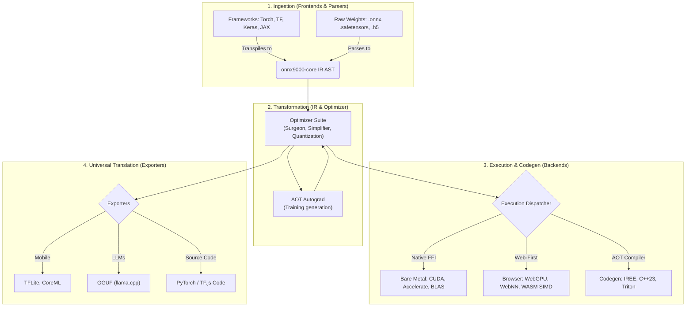

# onnx9000: Architecture Deep Dive

> **Speaker Note:** This document serves as the core architectural guide and presentation material for `onnx9000`. It details how we broke the dependency chain of modern ML deployment by replacing 40+ disparate tools with a single, unified Polyglot Monorepo.

## 1. The Core Philosophy (Why This Architecture?)

To understand the architecture, we must understand the crisis it solves. The traditional ML stack is plagued by massive C++ binaries, tangled CMake configurations, and fragile Python bindings. `onnx9000` was designed around four core pillars:

- **Zero-Dependency by Default:** No heavy C++ `protobuf` bindings, no `onnxruntime` installations. We utilize native `struct` unpacking in Python and `DataView` in JS.
- **Polyglot Monorepo:** We bridge Data Science and Engineering. Python (`uv`) handles data science tooling and heavy FFI; TypeScript (`pnpm`) powers the Edge, WebGPU, and UI.
- **WASM-First & AOT Compilation:** No bloated interpreters. Models are transpiled directly into micro-binaries, standalone WGSL shaders, or C++23.
- **Static Memory Arenas:** Total elimination of dynamic memory allocations (`malloc`/`new`) during inference via precise AOT topological planning.

---

## 2. The Polyglot Pipeline (Macro Architecture)

The system operates as a universal, highly decoupled N-to-N converter and execution engine.

---

## 3. Deep Dive: Component Lifecycle

When presenting, walk through the lifecycle of a model as it moves through the `onnx9000` ecosystem.

### A. The Ingestion Layer
Located in `packages/python/onnx9000-converters` and the core parsers.
- **Native Decoders:** Instead of relying on the official C++ ONNX bindings, `onnx9000` ships with pure Python/TS decoders for Protobuf and FlatBuffers.
- **Closed-form Parsing:** Capable of perfectly ingesting PyTorch AOTAutograd (`torch.export`), JAX `ClosedJaxpr`, and Keras 3 Functional graphs into the unified IR without requiring the original frameworks to be installed.
- **Rescuing Legacy Models:** Bridges `.caffemodel`, `.pb`, and `.h5` into the modern era.

### B. The Unified Core IR
Located in `@onnx9000/core` (`packages/js/core` and `packages/python/onnx9000-core`). The Intermediate Representation (`Graph`, `Node`, `Tensor`, `ValueInfo`) is the beating heart of the project.
- **Topological Guarantee:** Nodes are strictly ordered.
- **Shape/Type Strictness:** Every edge has concretely resolved shapes and `dtype`.
- **Zero-Stub Primitive Registry:** Full mapping of all core mathematical primitives with zero stubs.

### C. The Optimizer & Memory Planner
Before execution, the graph undergoes extensive surgery (`onnx9000-optimizer`):
- **Algebraic Simplification:** Constant folding, sparsity pruning, and INT4/INT8 quantization.
- **Memory Arena Planning:** A `MemoryPlanner` calculates exact tensor lifespans AOT. It assigns offsets within a single contiguous `MemoryArena`, guaranteeing zero dynamic allocations at runtime.

### D. Execution & Compilation

**Web & Edge (`@onnx9000/backend-web`)**
- **WebGPU Shaders (WGSL):** Dynamically compiled compute pipelines for the browser.
- **WebNN API:** Direct NPU access via `navigator.ml`.
- **Serverless Edge:** High-performance serving for Cloudflare Workers, Bun, and Deno.

**Hardware Native (`onnx9000-backend-native`)**
- Uses lightweight Python FFI (`ctypes`) dispatch to invoke BLAS/CUDA endpoints directly on raw memory arenas, completely bypassing traditional C++ runtime wrappers.

**The Codegen Engine (`@onnx9000/compiler`)**
- **C++ / TinyML:** Maps IR into standalone, zero-dependency C++23 source code (`onnx9000-c-compiler`).
- **Web-MLIR (IREE):** Compiles graphs into `.wvm` bytecodes.
- **Triton:** Generates optimized `@triton.jit` kernels for Nvidia GPUs.

---

## 4. Advanced Subsystems

### Autograd & On-Device Training
Found in `packages/python/onnx9000-toolkit`. Unlike runtimes that require a separate training engine, `onnx9000` features **AOT symbolic reverse-mode autograd**. It walks the IR DAG backwards, generating the backward pass directly into a static ONNX graph. This enables on-device federated training right in the browser.

### The Universal IDE & Tooling
- **`apps/netron-ui`**: A client-side, WebGL-accelerated interactive graph editor capable of parsing >10GB models at 60FPS.
- **Universal Drop-ins**: `onnx9000` provides API shims (`@onnx9000/tfjs-shim`) to transparently replace `@tensorflow/tfjs` and other legacy tools.

### Distributed MLOps (The Frontier)
The future of `onnx9000` is **Planet-Scale P2P Browser Swarms**.
- **WebRTC Transport:** Utilizing DataChannels for clustering web browsers (`onnx9000-network`).
- **Distributed Inference & Training:** Splitting workloads across edge devices via a `DistributedOptimizer` over Ring-AllReduce without centralized servers.
