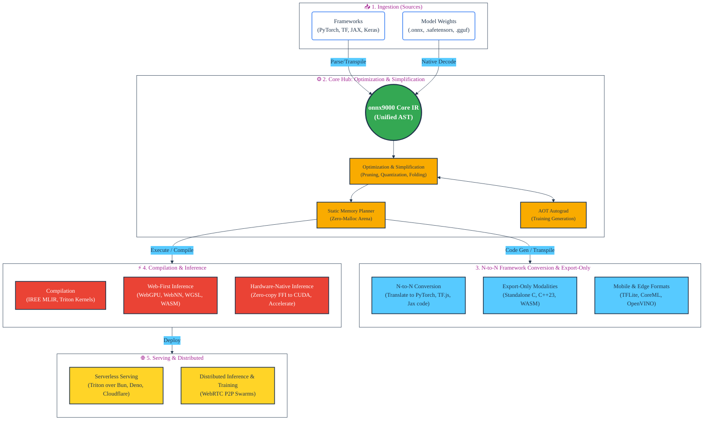

# onnx9000: Architecture Deep Dive

> **Speaker Note:** This document serves as the core architectural guide and presentation material for `onnx9000`. It details how we broke the dependency chain of modern ML deployment by replacing 40+ disparate tools with a single, unified Polyglot Monorepo.

## 1. The Core Philosophy (Why This Architecture?)

To understand the architecture, we must understand the crisis it solves. The traditional ML stack is plagued by massive C++ binaries, tangled CMake configurations, and fragile Python bindings. `onnx9000` was designed around four core pillars:

- **Zero-Dependency by Default:** No heavy C++ `protobuf` bindings, no `onnxruntime` installations. We utilize native `struct` unpacking in Python and `DataView` in JS.
- **Polyglot Monorepo:** We bridge Data Science and Engineering. Python (`uv`) handles data science tooling and heavy FFI; TypeScript (`pnpm`) powers the Edge, WebGPU, and UI.
- **WASM-First & AOT Compilation:** No bloated interpreters. Models are transpiled directly into micro-binaries, standalone WGSL shaders, or C++23.
- **Static Memory Arenas:** Total elimination of dynamic memory allocations (`malloc`/`new`) during inference via precise AOT topological planning.

---

## 2. The Polyglot Pipeline (Macro Architecture)

The system operates as a universal, highly decoupled N-to-N converter and execution engine.

---

## 3. Deep Dive: The 5-Phase Component Lifecycle

When presenting, walk through the lifecycle of a model as it moves through the `onnx9000` ecosystem. This lifecycle strictly follows the five phases outlined in the macro architecture.

### A. Phase 1: Ingestion (Sources)

Located in `packages/python/onnx9000-converters` and the core parsers.

- **Native Decoders:** Instead of relying on official C++ bindings, `onnx9000` ships with pure Python/TS decoders for Protobuf, FlatBuffers, Safetensors, and GGUF.
- **Closed-form Parsing:** Capable of perfectly ingesting PyTorch AOTAutograd (`torch.export`), JAX `ClosedJaxpr`, and Keras 3 Functional graphs into the unified IR without requiring the original frameworks at runtime.
- **Rescuing Legacy Models:** Bridges `.caffemodel`, `.pb`, and `.h5` into the modern era.

### B. Phase 2: Core Hub (Optimization & Simplification)

Located in `@onnx9000/core` and `onnx9000-optimizer`.

- **The Unified Core IR:** A strict N-dimensional AST where every edge has concretely resolved shapes and `dtype`. Features a zero-stub primitive registry.
- **Optimization & Simplification:** In-memory graph surgery performing algebraic simplification, constant folding, sparsity pruning, and INT4/INT8 quantization.
- **Static Memory Arenas:** A `MemoryPlanner` calculates exact tensor lifespans AOT. It assigns offsets within a single contiguous `MemoryArena`, guaranteeing zero dynamic allocations (`malloc`/`new`) at runtime.
- **AOT Autograd:** Symbolic reverse-mode autograd generates the backward pass directly into the static graph, enabling training without a separate engine.

### C. Phase 3: N-to-N Framework Conversion & Export-Only

`onnx9000` is not just a runtime; it is a universal translator (`@onnx9000/compiler` and `onnx9000-exporters`).

- **N-to-N Code Generation:** Translates the optimized IR back into idiomatic framework source code (e.g., generating PyTorch `nn.Module`, TensorFlow.js code, or Jax models).
- **Export-Only Modalities:** Generates standalone, zero-dependency C99, C++23, or WASM binaries tailored for embedded systems (TinyML) and microcontrollers.
- **Mobile & Edge:** Seamless translation into hardware-specific formats like TFLite, Apple CoreML, and Intel OpenVINO.

### D. Phase 4: Compilation & Inference

Execution is heavily decoupled into distinct modalities depending on the deployment target.

- **Compilation:** Maps IR directly into MLIR (via IREE) for bytecode generation, or emits optimized `@triton.jit` kernels for maximum throughput on Nvidia/AMD GPUs.
- **Web-First Inference (`@onnx9000/backend-web`):** Executes dynamically compiled WebGPU compute shaders (WGSL), WebNN API calls (direct NPU access), and WASM SIMD instructions right in the browser.
- **Hardware-Native Inference (`onnx9000-backend-native`):** Uses ultra-lightweight Python FFI (`ctypes`) to invoke BLAS/CUDA endpoints directly on raw memory arenas, bypassing traditional C++ runtime wrappers entirely.

### E. Phase 5: Serving & Distributed

The final mile of ML deployment, bringing models to the edge and the swarm.

- **Serverless Serving:** Highly optimized serving wrappers utilizing Triton semantics, built natively for edge-runtimes like Cloudflare Workers, Bun, and Deno.
- **Distributed MLOps (The Frontier):** Planet-Scale P2P Browser Swarms. Utilizes WebRTC DataChannels (`onnx9000-network`) to split workloads across edge devices via a `DistributedOptimizer` over Ring-AllReduce—completely eliminating centralized inference servers.

---

## 4. Universal IDE & Tooling

While not strictly part of the inference execution pipeline, `onnx9000` provides foundational tooling for the ML engineering lifecycle:

- **`apps/netron-ui`**: A client-side, WebGL-accelerated interactive graph editor capable of parsing >10GB models at 60FPS.
- **Universal Drop-ins**: API shims (`@onnx9000/tfjs-shim`) transparently replace `@tensorflow/tfjs` and other legacy tools within existing projects to incrementally bring the `onnx9000` speedup to legacy codebases.
