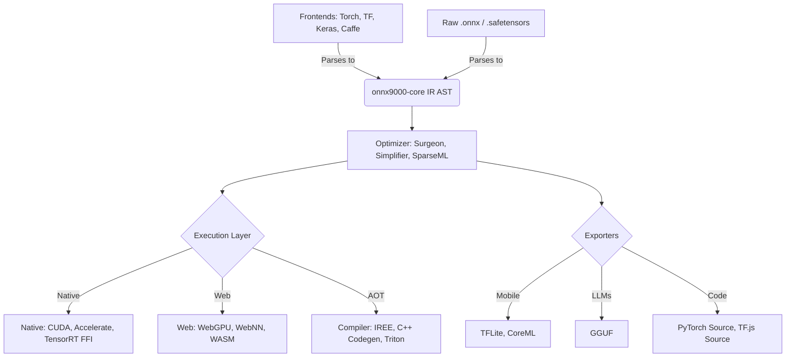

# onnx9000: Architecture Deep Dive

This document details the internal architectural design of `onnx9000`. It is intended for core contributors, framework engineers, and advanced users who want to understand exactly how `onnx9000` parses, optimizes, and compiles machine learning graphs into bare-metal C++, WebAssembly, and dozens of other formats.

> **Note:** The `onnx9000` architecture relies on a strict **Polyglot Monorepo** design. The core IR is decoupled and isolated in `packages/python/onnx9000-core` and `packages/js/core`.

## 1. The Polyglot Monorepo Architecture

`onnx9000` is built as a highly decoupled pipeline. A graph flows through the system in strict, modular packages managed by `uv` (Python) and `pnpm` workspaces (JS):

## 2. The Core Intermediate Representation (IR)

The foundation lives in `packages/python/onnx9000-core` and `packages/js/core` (published as `@onnx9000/core`).

The IR (`Graph`, `Node`, `Tensor`, `ValueInfo`) is a flattened, heavily typed list of operations. It guarantees:

1. **Topological Sorting:** Nodes are strictly ordered.
2. **Shape and Type Inference:** Every edge has a concretely resolved `shape` and `dtype`.
3. **Zero Dependencies:** Python uses `struct`/`mmap`. TypeScript uses `DataView`/`ArrayBuffer`.
4. **Validation:** Built-in parity with `onnx.checker`.

## 3. The Frontend Converters & Parsers

The system ingests models through `packages/python/onnx9000-converters`:

- **Zero-Heavy-Dependency:** Avoids official C++ `onnx` bindings. Ships with pure Python/TS definitions.
- **Extensibility:** Frontends for PyTorch, Scikit-Learn, XGBoost, and legacy formats (Caffe, MXNet) map their ASTs directly into the core IR.

## 4. The Backend Exporters

`onnx9000` acts as a universal N-to-N converter:

- **TFLite (`onnx9000-tflite-exporter`):** Emits FlatBuffers for Android NNAPI/EdgeTPU.
- **MLIR (`@onnx9000/compiler`):** Compiles static graphs into standard MLIR dialects.
- **C++ (`onnx9000-c-compiler`):** Generates standalone, zero-dependency C++ code.
- **CoreML (`@onnx9000/coreml`):** Emits Apple MIL and `.mlpackage` archives.
- **GGUF (`onnx9000-onnx2gguf`):** Translates models into `llama.cpp` compatible binaries.

## 5. Hardware Native Backends (Python)

Located in `packages/python/onnx9000-backend-native`:

- **Static Memory Arenas:** Total elimination of dynamic memory allocations during inference.
- **CTYPES / FFI Dispatch:** Uses `ctypes` to invoke BLAS/CUDA endpoints directly on raw memory.

## 6. Web Backends (TypeScript)

Located in `packages/js/backend-web` (published as `@onnx9000/backend-web`):

- **WebGPU Shaders (WGSL):** Compiled dynamically into WebGPU Compute pipelines.
- **WebNN API:** Integrates directly with `navigator.ml`.
- **WASM SIMD:** High-speed CPU fallback.

## 7. The Codegen Engine

- **C++ / TinyML:** Maps IR into C++23 source code using Jinja templates.
- **OpenAI Triton:** Generates optimized `@triton.jit` kernels for Nvidia GPUs.
- **Web-MLIR (IREE):** Compiles graphs into `.wvm` bytecodes interpreted in WASM.

## 8. The Autograd Subsystem

Found in `packages/python/onnx9000-toolkit`:

- **AOT Compilation:** Walks the IR DAG backwards to insert VJP nodes.
- **Unified Graph:** Results in a single `.onnx` graph containing both forward and backward steps.

## 9. Edge Serving & API Shims

- **Serverless Serving:** `@onnx9000/serve` provides a high-performance server for Cloudflare Workers and Bun.
- **TF.js Drop-in:** `@onnx9000/tfjs-shim` allows replacing `@tensorflow/tfjs` transparently.

## 10. Tooling, Visualization & Profiling

- **Graph Editing:** WebGL-accelerated `apps/netron-ui` for inspecting massive models.
- **Diagnostics:** `onnx9000-optimizer` evaluates MACs, FLOPs, and memory footprint.

## 11. Distributed MLOps

Expanding into networking (`onnx9000-network`) and orchestration (`@onnx9000/mlops`):

- **WebRTC Transport:** P2P DataChannels for clustering web browsers.
- **Distributed Inference:** Splitting workloads across edge devices.
- **Federated Training:** `DistributedOptimizer` for decentralized training over Ring-AllReduce.
